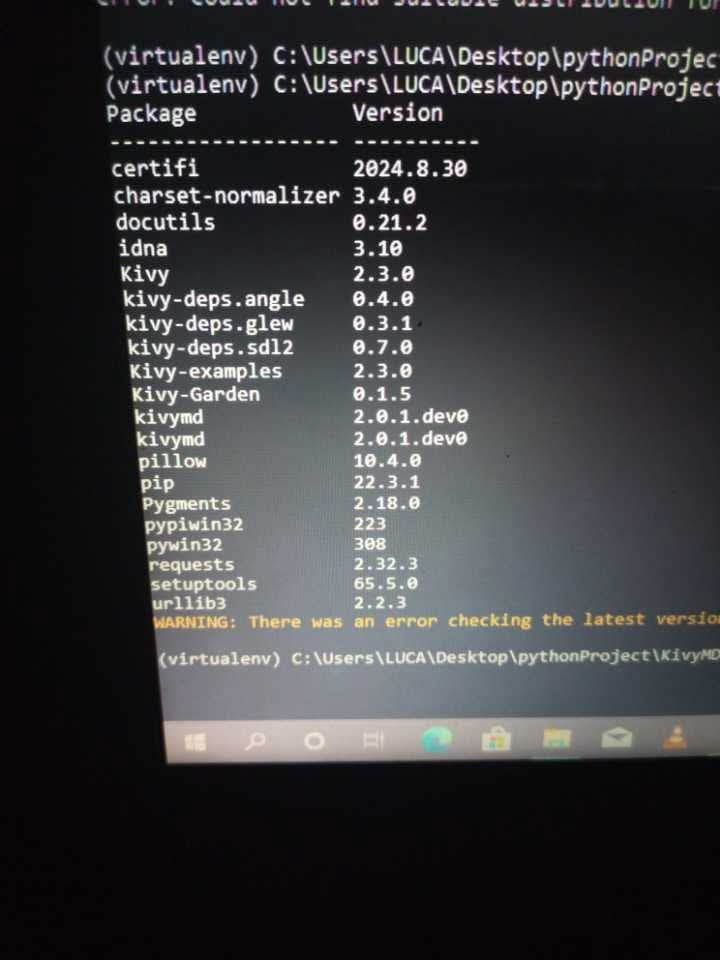
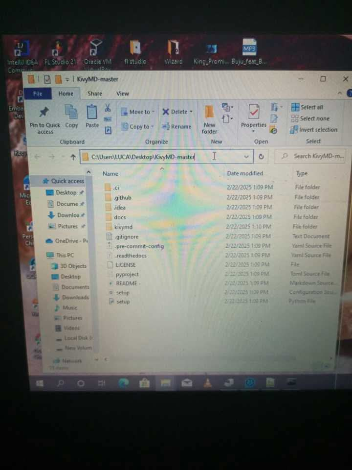

# # Installing KivyMD 2.0.1 (Latest)

*A complete installation guide for KivyMD 2.0.1 with dependencies and setup instructions.*


---

## 📖 Overview

This repository provides a **step-by-step guide** on how to manually install **KivyMD 2.0.1**.  
The instructions cover both **virtual environment installation** (recommended) and **global environment installation**, including how to install dependencies and verify the setup.

---

## ⚡ Installation Methods

There are two ways to install KivyMD:

1. **Using a Virtual Environment** (recommended)
2. **Using the Global Python Environment**

---

## 1️⃣ Installation in a Virtual Environment (Recommended)

If you prefer to create a **new virtual environment** for each project:

1. **Create a new virtual environment**  
   ```bash
   python -m venv myenv


2. **Activate the environment**
   On Windows:
   ```bash
   myenv\Scripts\activate
   ```
   On Linux / macOS:
   ```bash
   source myenv/bin/activate
   ```


3. **Install Kivy**
   ```bash
   pip install kivy
   ```

4. **Download KivyMD** from the official repository:[KivyMD Master ZIP](https://github.com/kivymd/KivyMD/archive/master.zip).


6. **Extract the downloaded ZIP file** *(recommended: extract on Desktop).
(📷 Add screenshot here: Extracted folder on Desktop)*


7. **Navigate to the extracted directory** using the terminal.
Assuming your virtual environment is named myenv, you can run:
   ```bash
   cd Desktop\KivyMD-master
   ```

*(Replace myenv with the name of your environment if you used another name)*


8. **Run the installation command**
   ```bash
   python setup.py install
   ```


---

## 2️⃣ Installation in Global Python Environment

If you want to install **globally** (without creating a virtual environment):

1. **Uninstall old KivyMD version**(if installed):
   ```bash
   pip uninstall kivymd
   ```

2. **Download KivyMD from:** [KivyMD Master ZIP](https://github.com/kivymd/KivyMD/archive/master.zip).

3. **Extract the ZIP file** (e.g., to Desktop).
*(📷 screenshot : Open file window with extracted folder)*
   

4. **Highlight the folder** address in File Explorer, **delete** the highlighted address and type cmd, and press **Enter.**
This will open a terminal directly inside the extracted folder.
*(📷 Add screenshot here: highlighted folder address + CMD window open)*
   
   
6. **Run the installation command**
   ```bash
   python setup.py install
   ```


---

## 📦 Installing Dependencies

After installing KivyMD, you need to install the required dependencies.

**Option 1: Install directly with pip**
  ```bash
     pip install kivy>=2.3.0 pillow materialyoucolor>=2.0.7 asynckivy>=0.6,<0.7
  ```
**Option 2: Use a** requirements.txt **file**

1. Create a file named requirements.txt and add the following:
```
   kivy>=2.3.0
   pillow
   materialyoucolor>=2.0.7
   asynckivy>=0.6,<0.7
```

2. Save it, then install with:
```bash
   pip install -r requirements.txt
```


---

## ✅ Verification

To check if installation was successful, run:
```bash
   python -m pip show kivymd
```
You should see version **2.0.1** (or the latest master build).


---

## 📌 Notes

It’s recommended to always use a **virtual environment** to avoid version conflicts.

Replace myenv with the name of your environment if you chose a different name.

Screenshots can be added in place of the  placeholders.


---

🎉 That’s it! You now have KivyMD 2.0.1 installed successfully.

---
